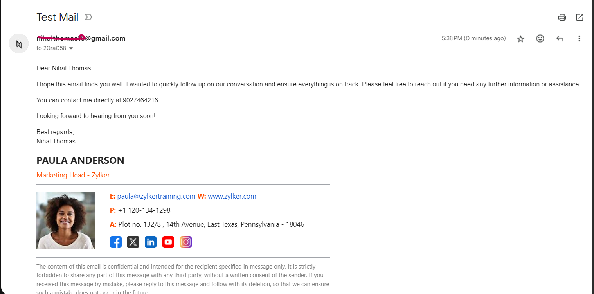

# Desktop Application for Personalized Mailing System Automation

## Project Overview
The **Desktop Application for Personalized Mailing System Automation** is a user-friendly desktop app built with the **Electron framework** to automate the process of sending personalized emails. Users can create and send emails by typing directly into the app or uploading a template with placeholders. The app supports integrating user data from a CSV file to dynamically fill in placeholders, such as names, to create customized messages. 

Although OAuth authentication is in the application’s design, it is currently disabled due to the testing phase. The application allows easy customization with features like adding signatures, inserting images, adjusting text size, and more.

## Features
- **Personalized Email Sending**: Send personalized emails by using placeholders (e.g., `{Name}`) and filling them with data from a CSV file.
- **Email Templates**: Upload an email template with placeholders and automatically fill them using a CSV file.
- **User-Friendly Interface**: The intuitive interface allows easy email creation and management with features like text alignment, font size adjustments, and image insertion.
- **Signature Support**: Add customized signatures to your emails.
- **CSV Integration**: Upload a CSV file with names or other details to replace placeholders within the email content.
- **Testing Stage**: OAuth authentication buttons are included but currently disabled as the application is in its testing phase.

## Technologies Used
- **Electron**: Framework for building the desktop application.
- **JavaScript**: Used for the front-end development.
- **Nodemailer**: For email automation and sending personalized emails.
- **CSV Files**: Used for importing user data and filling placeholders.

## Installation

1. Clone this repository:
   ```bash
   git clone https://github.com/your-username/Mail-Hawk-Mailing-System.git

   ## Installation

2. **Install dependencies using npm**:
    ```bash
    npm install
    ```

3. **Run the application**:
    ```bash
    npm start
    ```

## Application Usage

1. **Typing a Message**: You can type a personalized email directly within the app.

2. **Using a Template**:
   - Upload an email template that contains placeholders (e.g., `{Name}`).
   - Upload a CSV file with a `Name` column to replace the `{Name}` placeholder in the template with the actual names from the CSV.

3. **Customize Your Email**:
   - Add a signature to your email.
   - Insert an image into the email body.
   - Adjust text alignment and font size to your liking.

4. **Sending the Email**: Once the email is ready, click the **Send** button (OAuth functionality is currently disabled for testing).

## Application Images

### Application Screenshot

*Application interface.*

### Output Screenshot

final output of a personalized email.*

## Contributing

Contributions are welcome! If you want to improve the functionality or fix any bugs, please fork the repository and submit a pull request.
